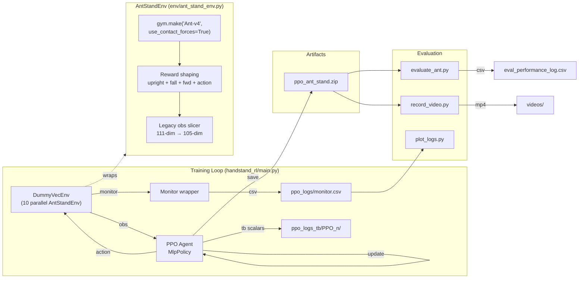
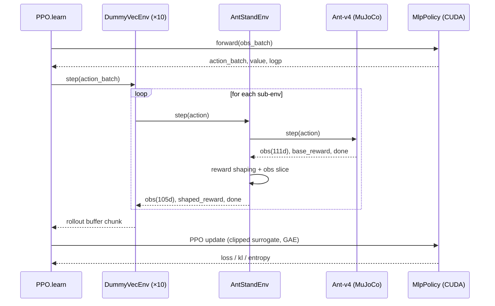

# Ant-RL-Locomotion

> Reward-shaped PPO training for the MuJoCo Ant quadruped — from "barely upright" to "walking shakily."

A reinforcement-learning sandbox built on Gymnasium's `Ant-v4` MuJoCo environment, a custom reward-shaping wrapper, and Stable-Baselines3 PPO. The project iterates on reward design and training infrastructure to coax the 4-legged Ant out of its default forward-locomotion behavior into a stable, upright, slowly walking gait.

---

## Badges


[](./LICENSE)

---

## Table of Contents

1. [Project Overview](#project-overview)
2. [Features](#features)
3. [Architecture Overview](#architecture-overview)
4. [Repository Structure](#repository-structure)
5. [Tech Stack](#tech-stack)
6. [Installation Guide](#installation-guide)
7. [Environment Setup](#environment-setup)
8. [Usage Guide](#usage-guide)
9. [Codebase Deep Dive](#codebase-deep-dive)
10. [AI/ML Details](#aiml-details)
11. [Performance Notes](#performance-notes)
12. [Engineering Decisions and Tradeoffs](#engineering-decisions-and-tradeoffs)
13. [Troubleshooting](#troubleshooting)
14. [Roadmap](#roadmap)
15. [Contributing](#contributing)
16. [License](#license)
17. [Credits and Acknowledgements](#credits-and-acknowledgements)

---

## Project Overview

**What it does.** This repository trains a Proximal Policy Optimization (PPO) agent on a *custom-rewarded* version of the MuJoCo Ant environment. The base environment (`Ant-v4` from Gymnasium/MuJoCo) rewards forward locomotion. This project replaces and augments that reward signal to push the agent toward an *upright, stable, forward-walking* policy — the long-term goal hinted at by the package name `handstand_rl` is a fully vertical/handstand pose, with intermediate milestones along the way (stand → balance → walk shakily → walk smoothly).

**Why it exists.** Standard `Ant-v4` policies converge to a low-slung "scuttle" that maximizes forward velocity by sacrificing posture. That's not useful for downstream tasks where the agent needs to maintain a target body height (inspection robots, balance-aware locomotion, transfer to legged hardware). The repository is a controlled environment to:

- Experiment with **dense reward shaping** for posture + locomotion.
- Track **training stability and progression** across many runs (TensorBoard + CSV).
- Iterate on **observation-space compatibility** between Gymnasium versions.
- Produce **reproducible, visualizable rollouts** (live MuJoCo viewer + offline video).

**Real-world applications.** Reward shaping for legged robots, sim-to-real research starting points, RL pedagogy, benchmarking PPO behavior under shaped vs. native rewards.

**Target users.** RL practitioners, robotics students, anyone exploring SB3 + Gymnasium MuJoCo workflows on Windows or Linux with a single GPU.

---

## Features

- **Custom reward-shaped environment** (`AntStandEnv`): upright bonus, fall penalty, forward-velocity reward, action-magnitude penalty.
- **Cross-version observation compatibility**: detects modern Gymnasium's 111-dim Ant obs and slices it back to the legacy 105-dim layout the saved model was trained against.
- **Vectorized training** with 10 parallel `AntStandEnv` instances via `DummyVecEnv` and `Monitor` wrappers.
- **TensorBoard logging** at `./ppo_logs_tb/` with one run directory per call to `model.learn(...)`.
- **CSV performance logging** for both training (`ant_performance_log.csv`) and evaluation (`eval_performance_log.csv`).
- **Unified evaluation CLI** (`evaluate_ant.py`) — choose between live MuJoCo viewer, deterministic vs. stochastic rollouts, headless mode, console prints, and CSV logging via flags.
- **Offline video recording** (`record_video.py`) using Gymnasium's `RecordVideo` wrapper with `rgb_array` rendering.
- **Quick-look plotting** (`plot_logs.py`) of reward and torso-height curves.
- **GPU-accelerated PPO updates** (CUDA 12.1) with CPU-side MuJoCo physics rollouts.
- **Pinned, reproducible dependency set** in `requirements.txt`.
- **Versioned progress changelog** (`Versions(Progress).md`) tracking reward-design iterations from V1 to V6.

---

## Architecture Overview

The system is a classic on-policy actor-critic loop with custom reward shaping injected at the environment boundary.



### Training data flow (per PPO iteration)



### Component relationships

| Component | Role |
|---|---|
| `AntStandEnv` | Gymnasium-compatible wrapper that owns reward shaping + obs reshaping. |
| `Monitor` | SB3 wrapper recording per-episode reward/length to CSV. |
| `DummyVecEnv` | Sequential vectorization of 10 envs (single-process). |
| `PPO` | SB3 algorithm; owns the policy, value net, GAE buffer, optimizer. |
| `MlpPolicy` | Default `[64, 64]` actor-critic MLP. |
| `evaluate_ant.py` | Load model, roll out, optional render/CSV/sleep/headless. |
| `record_video.py` | Roll out under `rgb_array` mode through `RecordVideo`. |
| `plot_logs.py` | Quick reward/height plot from CSV. |

---

## Repository Structure

```
Ant-RL-Locomotion/
├── handstand_rl/                   # Main Python package
│   ├── __init__.py
│   ├── main.py                     # Training entry point (PPO.learn → save)
│   ├── envs/
│   │   ├── __init__.py
│   │   └── ant_stand_env.py        # Custom reward-shaped Ant wrapper
│   ├── agents/                     # (reserved for future custom policies/agents)
│   ├── utils/                      # (reserved for shared helpers)
│   └── ant_performance_log.csv     # Per-step CSV emitted during in-script eval
│
├── evaluate_ant.py                 # Unified evaluation CLI (visual + CSV + headless)
├── record_video.py                 # Roll out and save MP4s to videos/
├── plot_logs.py                    # Plot Reward and TorsoHeight from training CSV
│
├── ppo_ant_stand.zip               # Trained PPO checkpoint (legacy 105-dim obs)
├── ant_performance_log.csv         # Per-step training-eval log
├── eval_performance_log.csv        # Per-step eval log (from evaluate_ant.py --csv)
├── evaluation_plot.png             # Cached plot output
│
├── ppo_logs/                       # SB3 Monitor CSV (per-episode reward/length)
│   └── monitor.csv
├── ppo_logs_tb/                    # TensorBoard run directories
│   └── PPO_n/                      # One per call to model.learn(...)
├── videos/                         # Recorded rollouts (mp4 + meta json)
│
├── requirements.txt                # Pinned dependency set
├── Versions(Progress).md           # Hand-written changelog of reward iterations
└── README.md                       # This file
```

Notes:

- The `handstand_rl/agents/` and `handstand_rl/utils/` directories are present but currently empty — placeholders for custom policies and shared helpers.
- A duplicate copy of `ant_performance_log.csv` lives inside `handstand_rl/`; this is a side effect of running `main.py` from inside that folder.

---

## Tech Stack

### Languages and Runtimes

| Item | Version |
|---|---|
| Python | 3.10 |
| CUDA | 12.1 (matched to PyTorch wheel) |

### Core ML / RL

| Library | Pinned Version | Role |
|---|---|---|
| `stable_baselines3` | 2.8.0 | PPO algorithm + VecEnv + Monitor |
| `torch` | 2.5.1+cu121 | Neural net backend |
| `torchvision` | 0.20.1+cu121 | (transitive; pulled with torch) |
| `gymnasium` | 1.2.3 | RL environment API |
| `mujoco` | 3.8.1 | Rigid-body physics simulator |
| `numpy` | 2.2.6 | Tensor math, observation shaping |

### Visualization / Logging

| Library | Pinned Version | Role |
|---|---|---|
| `tensorboard` | 2.20.0 | Training metric dashboards |
| `matplotlib` | 3.10.9 | Reward/height plots |
| `pandas` | 2.3.3 | CSV ingest for plots |
| `imageio` | 2.37.3 | Video frame encoding |
| `glfw` | 2.10.0 | MuJoCo "human" viewer windowing |
| `PyOpenGL` | 3.1.10 | OpenGL bindings for rendering |

### Tooling / Misc

| Library | Pinned Version |
|---|---|
| `cloudpickle` | 3.1.2 |
| `Farama-Notifications` | 0.0.6 |
| `protobuf` | 7.34.1 |
| `grpcio` | 1.80.0 |

The full pinned set lives in [`requirements.txt`](./requirements.txt).

---

## Installation Guide

### Hardware Requirements

- **GPU**: any CUDA-capable NVIDIA card. Tested with **RTX 4050 Laptop GPU (Ada, compute 8.9)**.
- **CPU**: 4+ cores recommended (10 vec envs run sequentially in `DummyVecEnv`).
- **RAM**: 8 GB+.
- **Disk**: ~3 GB for env + dependencies; TensorBoard runs grow over time.

### Operating Systems

- **Windows 10/11** — primary tested target.
- **Linux** — should work without changes (the original development environment per `Versions(Progress).md`).
- **macOS** — likely needs MuJoCo source builds; not tested here.

### Step 1 — Create a clean Conda environment

```cmd
conda create -n ant-rl python=3.10 -y
conda activate ant-rl
```

### Step 2 — Install PyTorch with CUDA first

Installing torch *before* `requirements.txt` ensures pip picks the CUDA wheel and not a CPU-only one.

```cmd
pip install torch==2.5.1+cu121 torchvision==0.20.1+cu121 --index-url https://download.pytorch.org/whl/cu121
```

CPU-only fallback (if you don't have a CUDA GPU):

```cmd
pip install torch==2.5.1 torchvision==0.20.1
```

### Step 3 — Install remaining dependencies

```cmd
pip install -r requirements.txt
```

### Step 4 — Verify the installation

```cmd
python -c "import torch; print('CUDA:', torch.cuda.is_available(), torch.cuda.get_device_name(0) if torch.cuda.is_available() else 'CPU')"
python -c "from handstand_rl.envs.ant_stand_env import AntStandEnv; e=AntStandEnv(); print('obs:', e.observation_space.shape, 'act:', e.action_space.shape)"
```

Expected:

```
CUDA: True NVIDIA GeForce RTX 4050 Laptop GPU
obs: (105,) act: (8,)
```

---

## Environment Setup

This project does **not** require API keys, secrets, or external datasets. The MuJoCo physics environment ships with the `mujoco` Python package, and the policy network learns from environment interaction only.

Optional environment variables:

| Variable | Purpose |
|---|---|
| `CUDA_VISIBLE_DEVICES=` | Force CPU-only execution (useful for debugging the small MLP). |
| `MUJOCO_GL` | Override GL backend (`glfw`, `egl`, `osmesa`). Set to `egl` for headless Linux servers. |

Example `.env` (not consumed automatically; export manually):

```bash
# .env (optional)
CUDA_VISIBLE_DEVICES=0
MUJOCO_GL=glfw
```

---

## Usage Guide

### Quick Start

```cmd
:: 1. Watch the bundled trained agent
python evaluate_ant.py

:: 2. Train from scratch (overwrites ppo_ant_stand.zip)
python -m handstand_rl.main

:: 3. Plot the most recent training-eval CSV
python plot_logs.py

:: 4. Record a video rollout
python record_video.py
```

### `handstand_rl/main.py` — Training

Runs `PPO("MlpPolicy", DummyVecEnv([...×10]))` for **1,000,000** timesteps, saves to `ppo_ant_stand.zip`, then runs an in-script 1000-step eval and writes `ant_performance_log.csv`.

```cmd
python -m handstand_rl.main
```

Notes:

- TensorBoard logs land at `./ppo_logs_tb/PPO_<n>/`. Launch with:
  ```cmd
  tensorboard --logdir ppo_logs_tb
  ```
- The current `main.py` does not yet pass `device="cpu"` or `device="cuda"`; SB3 picks GPU by default. For an MLP this small, **CPU is often faster** — see [Engineering Decisions](#engineering-decisions-and-tradeoffs).

### `evaluate_ant.py` — Evaluation CLI

```cmd
python evaluate_ant.py [options]
```

| Flag | Default | Description |
|---|---|---|
| `--model PATH` | `ppo_ant_stand` | Saved PPO model path (without `.zip`). |
| `--steps N` | `1000` | Number of evaluation steps. |
| `--csv` | off | Write per-step metrics to CSV. |
| `--csv-path PATH` | `eval_performance_log.csv` | Where to write the CSV. |
| `--no-print` | off | Suppress per-step console prints. |
| `--no-sleep` | off | Disable inter-step sleep (max throughput). |
| `--sleep S` | `0.02` | Per-step sleep when sleeping is on. |
| `--no-render` | off | Headless mode (no MuJoCo window). |
| `--stochastic` | off | Sample actions instead of `deterministic=True`. |

Examples:

```cmd
:: Visual + console print (default)
python evaluate_ant.py

:: Headless, max-speed CSV logging only
python evaluate_ant.py --csv --no-print --no-sleep --no-render

:: Stochastic rollout to inspect policy entropy
python evaluate_ant.py --stochastic --steps 500
```

CSV columns: `Step, Reward, TorsoHeight, Terminated, Truncated`.

### `record_video.py` — Offline Video

Rolls out for 1000 steps under `render_mode="rgb_array"` and writes MP4s to `videos/` via `gymnasium.wrappers.RecordVideo`.

```cmd
python record_video.py
```

### `plot_logs.py` — Quick Plot

Reads `ant_performance_log.csv` (the training-time eval log), plots `Reward` and `TorsoHeight` over `Step`, and writes `evaluation_plot.png`.

```cmd
python plot_logs.py
```

To plot the eval CSV instead, either rename `eval_performance_log.csv` → `ant_performance_log.csv`, or edit the `pd.read_csv` line.

---

## Codebase Deep Dive

### `handstand_rl/envs/ant_stand_env.py` — `AntStandEnv`

A `gym.Env` subclass that wraps `Ant-v4` and injects shaped rewards plus a backward-compatibility shim for observations.

**Key responsibilities:**

1. **Construct the inner env** with `use_contact_forces=True`. This forces Gymnasium to concatenate `cfrc_ext` (external contact-force tensor) into the observation, which is required for compatibility with the saved checkpoint.
2. **Reshape observations** when the inner env returns 111 dims. Modern Gymnasium includes the *world body's* `cfrc_ext` (always zero) which adds 6 unused dimensions. The wrapper slices `obs[27:33]` out so the policy network receives the original **105-dim** layout it was trained on:
   - `qpos[2:]` → 13 dims (body pose, excluding xy)
   - `qvel` → 14 dims (body velocity)
   - `cfrc_ext` for 13 (non-world) bodies → 78 dims
   - **Total: 105 dims**
3. **Override the reward** at every `step` with a four-term sum (see [AI/ML Details](#aiml-details)).

**Notable engineering details:**

- `_to_legacy(obs)` is a static helper that performs the slice; `_maybe_slice` short-circuits when the inner env already produces 105 dims (forward compatibility).
- `observation_space.low/high` are sliced too so SB3's shape checks pass.
- The `forward_reward` reads `self.env.unwrapped.data.qvel[0]` directly from MuJoCo's data buffer — the cleanest way to get the torso's instantaneous x-velocity.
- An earlier per-step `print(...)` was removed because it was a real performance drag at 10 envs × thousands of steps/sec during training.

### `handstand_rl/main.py` — Training Driver

```python
env = DummyVecEnv([make_env for _ in range(10)])
model = PPO("MlpPolicy", env, verbose=1, tensorboard_log="./ppo_logs_tb/")
model.learn(total_timesteps=1_000_000)
model.save("ppo_ant_stand")
```

**Sequence:**

1. Open `ant_performance_log.csv` and write a header row.
2. Build 10 vectorized envs, each wrapped in SB3's `Monitor`. `Monitor(filename=None)` keeps the wrapper's per-episode bookkeeping but does not write a per-env file.
3. Construct PPO with default hyperparameters (`n_steps=2048`, `batch_size=64`, `gamma=0.99`, `gae_lambda=0.95`, `clip_range=0.2`, `ent_coef=0.0`, `lr=3e-4`, `n_epochs=10`).
4. `learn(1_000_000)` — collects rollouts, computes GAE, performs clipped policy updates.
5. Save weights to `ppo_ant_stand.zip`.
6. Run a 1000-step deterministic rollout on a *single* `AntStandEnv(render_mode="human")` and log per-step `[Step, Reward, TorsoHeight, Terminated, Truncated]` to CSV.

**Caveats / things to clean up later:**

- `render_mode="Human"` (capitalized) in `make_env` is silently ignored by Gymnasium; the training envs effectively run with no rendering, which is the desired behavior. Recommend lowercasing or setting `None` to be explicit.
- `device` is not passed; SB3 defaults to CUDA when available even though the `[64, 64]` MLP is generally faster on CPU.

### `evaluate_ant.py` — Unified Evaluation

A single CLI entry point that replaced the earlier `evaluate_ant.py` (visual) + `evaluate_agent.py` (CSV) duo. Argparse exposes every behavioral toggle (render, sleep, print, CSV, deterministic).

Hot path:

```python
action, _ = model.predict(obs, deterministic=deterministic)
obs, reward, terminated, truncated, info = env.step(action)
```

A `try/finally` guarantees the CSV file handle and env are closed even on `Ctrl+C`.

### `record_video.py` — Headless Video Capture

1. Loads `ppo_ant_stand`.
2. Creates `AntStandEnv(render_mode="rgb_array")` so MuJoCo emits frames as numpy arrays instead of opening a window.
3. Wraps in `RecordVideo(..., episode_trigger=lambda e: True)` to record every episode.
4. Rolls out for 1000 steps.

The `print(type(frame), frame.shape)` line is a development sanity check — useful for confirming OpenGL is actually producing RGB frames.

### `plot_logs.py` — Diagnostic Plot

Reads CSV, plots `Reward` and `TorsoHeight` on the same axis, saves `evaluation_plot.png`. Note both quantities are plotted on a shared y-axis, which can be visually misleading — torso height (~0.3-0.7 m) and reward (potentially ±10) live on very different scales. Splitting into two subplots or twin y-axes is a small future improvement.

---

## AI/ML Details

### Algorithm: PPO (Clipped Surrogate Objective)

Stable-Baselines3 implements [Schulman et al. 2017's PPO](https://arxiv.org/abs/1707.06347) with the clipped surrogate objective:

$$
L^{CLIP}(\theta) = \mathbb{E}_t\!\left[\min\!\left(r_t(\theta)\,\hat{A}_t,\;\text{clip}(r_t(\theta), 1-\epsilon, 1+\epsilon)\,\hat{A}_t\right)\right]
$$

with $r_t(\theta) = \pi_\theta(a_t|s_t) / \pi_{\theta_{\text{old}}}(a_t|s_t)$. Advantages $\hat{A}_t$ are estimated via Generalized Advantage Estimation (GAE).

### Policy and Value Networks

- **Policy class:** `MlpPolicy` (SB3 default).
- **Architecture:** two-layer MLP `[64, 64]` with `tanh` activations, separate heads for the actor (mean of a diagonal Gaussian) and the critic. Action log-std is a learnable parameter independent of state.
- **Action distribution:** continuous diagonal Gaussian over $\mathbb{R}^8$ (the Ant's 8 joint torques).

### Hyperparameters (SB3 defaults — none overridden in `main.py`)

| Hyperparameter | Value |
|---|---|
| `learning_rate` | 3e-4 |
| `n_steps` (per env) | 2048 |
| `batch_size` | 64 |
| `n_epochs` | 10 |
| `gamma` | 0.99 |
| `gae_lambda` | 0.95 |
| `clip_range` | 0.2 |
| `ent_coef` | 0.0 |
| `vf_coef` | 0.5 |
| `max_grad_norm` | 0.5 |
| Total timesteps | 1,000,000 |
| Parallel envs | 10 (DummyVecEnv) |

Effective rollout buffer per update: `n_steps × n_envs = 20,480` transitions.

### Observation Space (105-dim, legacy layout)

| Index range | Length | Content |
|---|---|---|
| `[0:13]` | 13 | `qpos[2:]` — torso z, orientation quaternion, 8 joint angles |
| `[13:27]` | 14 | `qvel` — 6 root velocities + 8 joint velocities |
| `[27:105]` | 78 | `cfrc_ext` for 13 non-world bodies (each 6 dims: 3 force, 3 torque) |

`obs[0]` is the **torso z-coordinate** — used directly for reward shaping and logging.

### Action Space

Box(8,) of joint torques in `[-1, 1]`, mapped internally by MuJoCo to the Ant's eight hinge actuators (two per leg).

### Reward Function

The wrapped reward is the inner env's reward plus four shaping terms:

```
reward_total = base_reward
             + upright_bonus       // max(0, h − 0.5) × 5.0
             + fall_penalty        // −10 if h < 0.30 else 0
             + forward_reward      // 1.0 × x_velocity
             + action_penalty      // −0.001 × ||a||²
```

| Term | Formula | Intent |
|---|---|---|
| `upright_bonus` | $5.0 \cdot \max(0, h - 0.5)$ | Encourage torso height above 0.5 m. |
| `fall_penalty` | $-10 \cdot \mathbb{1}[h < 0.3]$ | Discourage low-slung crouch / falls. |
| `forward_reward` | $1.0 \cdot v_x$ | Encourage net forward motion. |
| `action_penalty` | $-0.001 \cdot \|a\|^2$ | Discourage jittery, high-torque actions. |

The base `Ant-v4` reward (alive bonus + forward velocity − control cost − contact cost) is preserved on top of these shaping terms, so the policy effectively sees a more strongly shaped variant of the original objective.

### Training Strategy

- **Vectorization:** 10 envs in `DummyVecEnv` (sequential, single process). `SubprocVecEnv` would parallelize the CPU-bound MuJoCo physics across cores — a clear future improvement.
- **Episode termination:** `Ant-v4`'s default healthy-z-range early termination (z ∈ [0.2, 1.0]) is preserved. Combined with `fall_penalty`, this gives both a hard signal (episode ends) and a dense signal (large negative reward) for falls.
- **Determinism at eval time:** `evaluate_ant.py` uses `deterministic=True` by default to expose the mean of the policy's Gaussian rather than samples, which gives a smoother visual rollout.

### GPU vs. CPU

For an `[64, 64]` MlpPolicy, network forward/backward passes are tiny relative to MuJoCo physics steps. SB3 itself prints a warning recommending CPU when not using a CNN policy. On this project's RTX 4050 setup, both work; CPU is often faster wall-clock because it avoids host↔device transfer overhead.

---

## Performance Notes

The repository does not include formal benchmarks, but inferable characteristics:

| Quantity | Approximate value |
|---|---|
| Effective rollout per update | 20,480 transitions |
| Updates per 1M-step run | ~49 |
| Wall-clock dominant cost | MuJoCo physics in the 10 sequential envs |
| Disk footprint per TB run | a few MB |
| Disk footprint of `ppo_ant_stand.zip` | ~few hundred KB (small MLP) |
| Eval throughput (`--no-render --no-sleep --no-print`) | hundreds of steps/sec on a single CPU core |

The `ppo_logs_tb/` directory in the repo contains 70+ historical PPO_n run directories — strong evidence of an iterative reward-shaping workflow rather than a single-shot training run.

---

## Engineering Decisions and Tradeoffs

- **`DummyVecEnv` over `SubprocVecEnv`.** Chosen for simplicity and Windows-friendliness (no fork issues). Tradeoff: the 10 envs step sequentially in one process, so MuJoCo physics becomes the wall-clock bottleneck. Switching to `SubprocVecEnv` is the single highest-impact future change for training speed.
- **Reward shaping inside the env wrapper, not as a callback.** Keeping shaping inline ensures it is applied uniformly during both training and evaluation and survives serialization through `PPO.load`. Tradeoff: shaping coefficients are baked in unless you re-instantiate the env with new constructor kwargs.
- **Legacy 105-dim observation slicing.** A small piece of compatibility glue that lets the trained checkpoint survive a Gymnasium upgrade. Without it, `model.predict(...)` raises `Unexpected observation shape (111,)`. The world body's `cfrc_ext` is always zero, so dropping those 6 dims is information-lossless.
- **Default SB3 hyperparameters.** Avoids premature optimization. The reward signal is the more impactful axis for a quadruped standing task; tuning hyperparameters before reward shaping converges is rarely worthwhile.
- **CSV + TensorBoard duplication.** TensorBoard for during-run dashboards, CSV for post-hoc plotting and easy diffing across runs. Slightly redundant but cheap and useful.
- **MlpPolicy default `[64, 64]`.** Small enough that GPU is debatable; large enough for `Ant-v4`'s 8-joint control. Bumping to `[256, 256]` typically helps once reward shaping is stable — flagged in the roadmap.

---

## Troubleshooting

| Symptom | Likely cause | Fix |
|---|---|---|
| `ValueError: Unexpected observation shape (27,) for Box environment, please use (105,)` | Inner env not configured with `use_contact_forces=True`. | Ensure `AntStandEnv` is the version in this repo (the constructor sets it). |
| `(111,)` returned from `observation_space.shape` | Legacy slicing not active. | Confirm the `_needs_legacy_slice` branch in `AntStandEnv.__init__` is reached; inner obs space should be inspected. |
| `UserWarning: PPO on the GPU ... primarily intended ... CPU` | Expected with MlpPolicy. | Either ignore, or force CPU via `device="cpu"` in `PPO(...)` or `set CUDA_VISIBLE_DEVICES=` in cmd. |
| `DeprecationWarning: Ant-v4 is out of date ... v5` | Gymnasium nudge. | Stay on v4 to keep the saved checkpoint compatible. Migrating to v5 requires retraining. |
| MuJoCo viewer never opens / blank window | `render_mode` not set to `"human"` (case-sensitive) or GLFW backend missing. | Use `render_mode="human"` exactly. On Linux servers, set `MUJOCO_GL=egl` and use `record_video.py` instead. |
| `RuntimeError: CUDA error: ...` on `model.predict` | Driver/CUDA mismatch between torch wheel and installed driver. | Reinstall torch matching your driver's max CUDA via `nvidia-smi`. |
| Training looks stuck / no console output | `verbose=1` only logs at PPO update boundaries (every `n_steps × n_envs = 20,480` steps). | Wait, or pass `verbose=2`. |

---

## Roadmap

- **Faster training**: switch `DummyVecEnv` → `SubprocVecEnv`; consider `device="cpu"` for the MlpPolicy explicitly.
- **Larger policy**: `policy_kwargs=dict(net_arch=[256, 256])` once reward shaping stabilizes.
- **Curriculum learning**: progressively raise `height_threshold` and tighten the unhealthy-z range (0.4 → 0.5 → 0.6) — already flagged in `Versions(Progress).md`.
- **Reward refinements**: torso angle / orientation penalty, energy-aware action cost, episode-length bonus for sustained standing.
- **Hyperparameter search**: small Optuna sweep over `learning_rate`, `gae_lambda`, `clip_range`, and reward coefficients.
- **Better evaluation**: episodic return aggregation, success rates ("held stand for ≥5 s", "torso angle < 15°"), seed-averaged plots.
- **Plot improvements**: dual-axis or subplot layout in `plot_logs.py`; CLI argument for the CSV path.
- **`Ant-v5` migration**: retrain end-to-end on the modern env to drop the legacy 105-dim shim entirely.
- **Algorithm comparison**: SAC and TD3 on the same shaped reward for a head-to-head benchmark.
- **Sim-to-real prep**: domain randomization on mass, friction, and motor strength.

---

## Contributing

Workflow:

1. Fork the repo and create a feature branch:
   ```bash
   git checkout -b feature/<short-name>
   ```
2. Run a smoke training (`--total-timesteps 10000` style override, once exposed) before opening a PR.
3. Keep PRs small and focused — one reward change or one infra change per PR.
4. Update `Versions(Progress).md` with a short bullet list of changes.

Branch naming: `feature/...`, `fix/...`, `experiment/...`, `docs/...`.

Commit messages: imperative present tense, scope-prefixed where useful, e.g., `env: add torso angle penalty` or `eval: add --csv-path arg`.

Coding standards: PEP 8, type hints on new functions, no per-step `print(...)` inside hot loops.

---

## License

This project is licensed under the **MIT License** — see the [`LICENSE`](./LICENSE) file for the full text.

In short: you are free to use, copy, modify, merge, publish, distribute, sublicense, and sell copies of this software, provided the copyright notice and the license text are included in all substantial portions. The software is provided "as is", without warranty of any kind.

Copyright © 2026 Aditya Guha.

---

## Credits and Acknowledgements

- **MuJoCo** physics — Roboti / DeepMind / Google. [mujoco.org](https://mujoco.org/)
- **Gymnasium** — Farama Foundation. [gymnasium.farama.org](https://gymnasium.farama.org/)
- **Stable-Baselines3** — Antonin Raffin et al. [stable-baselines3.readthedocs.io](https://stable-baselines3.readthedocs.io/)
- **PyTorch** — Meta AI. [pytorch.org](https://pytorch.org/)
- **PPO algorithm** — Schulman, J. et al. *Proximal Policy Optimization Algorithms.* arXiv:1707.06347.
- **GAE** — Schulman, J. et al. *High-Dimensional Continuous Control Using Generalized Advantage Estimation.* arXiv:1506.02438.
- The original `Ant-v4` environment design from the Gymnasium MuJoCo suite.
- Iteration history and reward-shaping notes captured in [`Versions(Progress).md`](./Versions(Progress).md).
